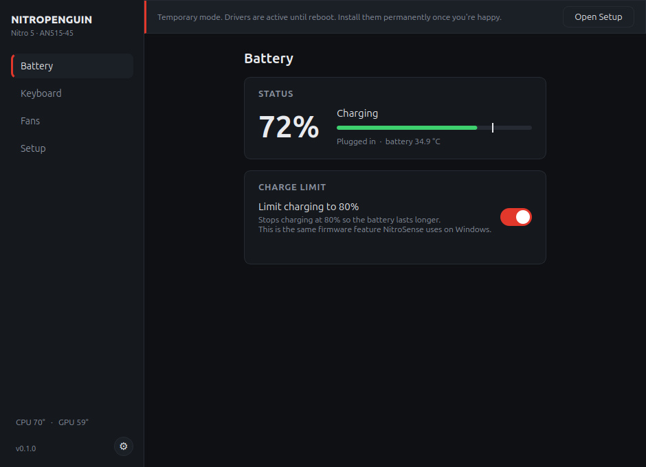
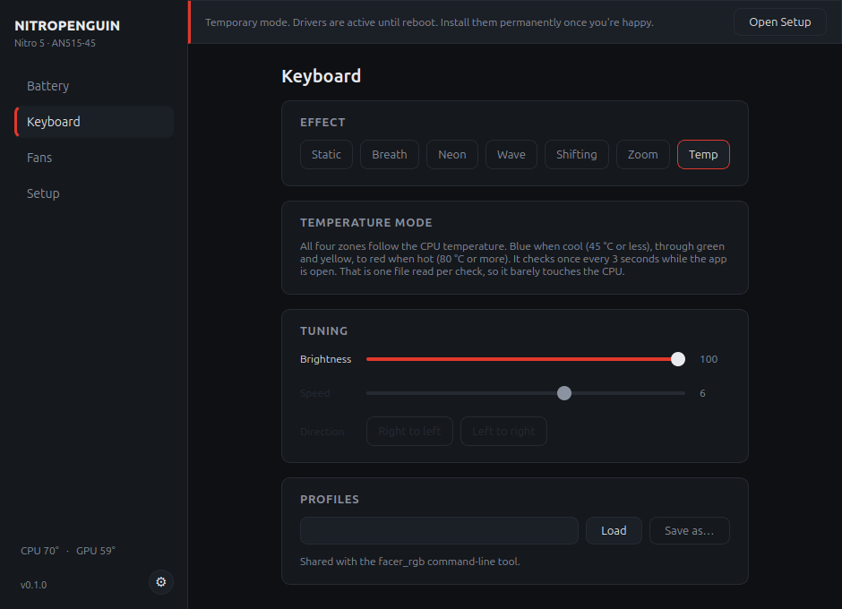
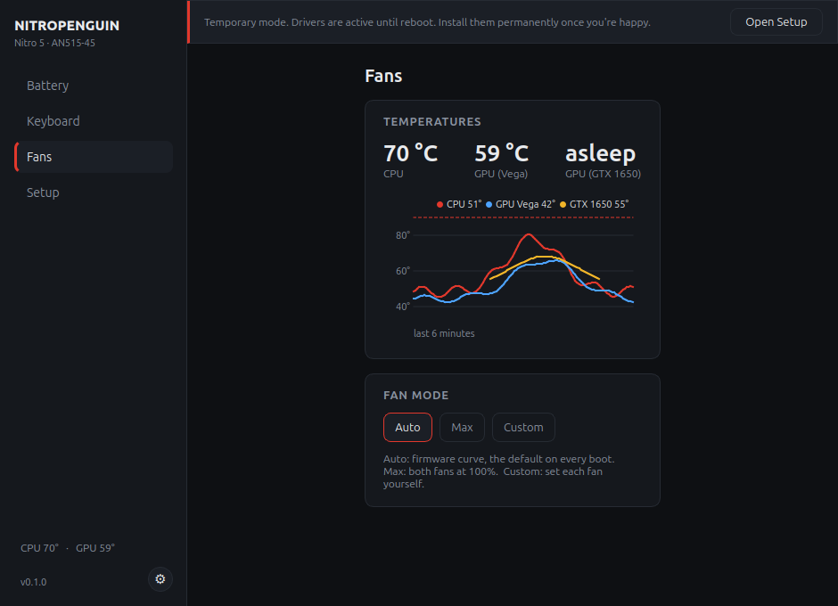
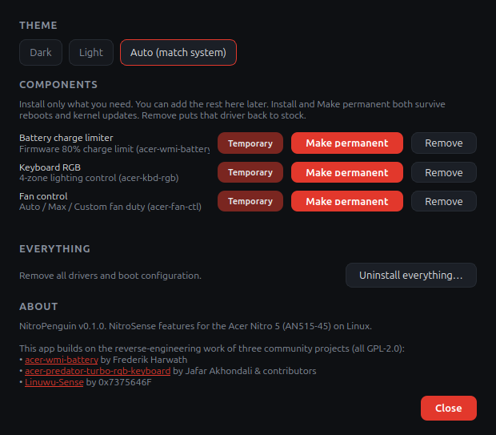

<p align="center">
  
</p>

<h1 align="center">🐧 NitroPenguin</h1>

<p align="center">
  NitroSense for Linux, on the Acer Nitro 5.<br>
  Battery charge limit, keyboard RGB, and fan control, in one small app.
</p>

---

When you move an Acer Nitro to Linux you lose NitroSense, and with it the
charge limit, the keyboard lighting, and fan control. NitroPenguin brings
those three back. It talks to the same laptop firmware NitroSense uses on
Windows, through three tiny kernel modules, and leaves your stock Ubuntu
drivers alone.

Built and tested on the **Nitro AN515-45** (Ryzen 5000 + GTX 1650). Other
Nitro and Predator models may work too. See [Supported devices](#-supported-devices).

> **Why this exists, and how it was built.** I moved my Nitro to Linux, lost
> NitroSense, and nothing I found brought it back cleanly. So I built the thing
> I needed.
>
> I am a CS student, not a kernel or hardware developer, and **this project was
> built with heavy AI assistance.** The kernel modules are adapted from the three
> GPL-2.0 projects credited at the bottom; the application around them was
> largely AI-written. I do not claim to have written it unaided, and I am still
> working through the driver code myself.
>
> What I did do is test every feature on my own laptop, on the model in the table
> below. I am saying this plainly because you are about to load code into your
> kernel — read it first, or wait for someone who can. It never replaces your
> stock drivers, and everything it does can be undone.



## 📦 Install

```bash
curl -sSL https://raw.githubusercontent.com/Creepyrishi/NitroPenguin/main/install.sh | bash
```

That installs the app: it clones the project, sets up its Python
environment with [uv](https://docs.astral.sh/uv/), and adds a launcher and a
menu entry. Then open **NitroPenguin** from your apps (or run `nitropenguin`)
and turn on the drivers you want from the Setup page.

The installer never touches your kernel on its own. You choose the battery,
RGB, and fan drivers inside the app, each behind a password. Re-run the line
to update. Remove the app with `bash install.sh --uninstall`.

Want to read it before running it? Download `install.sh` first and open it.

## ✨ What it does

### 🔋 Battery charge limit

Stops charging at 80% so the battery lasts longer. It is the same firmware
limit NitroSense offers on Windows. You get a desktop notification when it
kicks in, and the app shows when the battery is being held at 80%.

### 🌈 Keyboard RGB

Six firmware effects (static, breath, neon, wave, shifting, zoom) with
per-zone colors on the four-zone keyboard, plus brightness, speed, and
direction. There is also a **Temp** mode: all four zones follow the CPU
temperature, blue when cool and red when hot. It reads one sensor every
three seconds, so it costs almost nothing.



### 🌀 Fan control

Auto, Max, or Custom per-fan duty, with live CPU and GPU temperatures and a
six-minute history graph. Custom mode has guards NitroSense does not: the
sliders will not go below 30%, and if the CPU or GPU passes 90 °C the app
puts the fans back on Auto. Every boot starts on the firmware curve.



### ⚙️ One place to manage it

Dark, light, or match-your-system theme. Install only the features you want
and add the rest later.

### 🪶 Light on memory

The window is a normal desktop app: open it when you need it, close it when
you're done, and it fully exits. The always-on work (Temp keyboard mode, the
fan watchdog, the 80% notification) runs in a small background daemon that
uses about 17 MB and starts automatically at login. Press the **Nitro key**
to open the window any time.



## 🛠️ How it works

The firmware inside the laptop already knows how to set the charge limit,
the lighting, and the fans. Reading that firmware is the hard part, and three
community projects worked it out. NitroPenguin takes only the small pieces
that talk to the firmware and ships them as three focused modules:

- `driver/acer-wmi-battery` for the charge limit
- `driver/acer-kbd-rgb` for the keyboard
- `driver/acer-fan-ctl` for the fans

Your stock `acer_wmi` driver is never replaced or blacklisted. Nothing runs
in your kernel until you install a module from the Setup page, and each one
can be removed cleanly from the same place.

## 🖥️ Supported devices

Confirmed working. If you run it on another model, please add a row (see
[Contributing](#-contributing)).

| Model | Battery limit | Keyboard RGB | Fan control | Notes |
|-------|:---:|:---:|:---:|-------|
| Nitro AN515-45 | ✅ | ✅ | ✅ | Ryzen 5000 + GTX 1650, four-zone RGB. Tested end to end. |

Battery limit alone is known to work on several siblings (AN515-44, -57, -58)
through the upstream `acer-wmi-battery` driver. RGB and fans use the Acer
gaming firmware interface, so they are likely on Nitro and Predator models
that have it. The app probes your firmware and only shows what it finds, so
trying it is safe.

## 🤝 Contributing

Clone it, change it, open an issue, or send a pull request. All welcome.

```bash
git clone https://github.com/Creepyrishi/NitroPenguin.git
cd NitroPenguin
uv sync
uv run nitropenguin
```

**Ran it on a different model?** That is the most useful thing you can share.
Open the app, try each feature, then edit the Supported devices table above
and send a pull request with a new row: your model, what worked, and a short
note (CPU/GPU, keyboard type, kernel version). If something did not work,
open an issue with the model and what happened, and include `sudo dmesg | tail`
if a driver failed to load.

## 🔌 Uninstall

From the app: Settings, then Uninstall everything, or remove one driver at a
time. From a terminal: run the matching `driver/uninstall-*.sh` script, or
`bash install.sh --uninstall` to remove the app itself. Any firmware setting
also resets on a full power cycle (shut down, unplug, hold power for 30 s).

## 🙏 Credits

NitroPenguin builds on the reverse-engineering work of three projects, all
GPL-2.0:

- [acer-wmi-battery](https://github.com/frederik-h/acer-wmi-battery) by Frederik Harwath, for the charge limit
- [acer-predator-turbo-and-rgb-keyboard-linux-module](https://github.com/JafarAkhondali/acer-predator-turbo-and-rgb-keyboard-linux-module) by Jafar Akhondali and contributors, for the four-zone RGB
- [Linuwu-Sense](https://github.com/0x7375646F/Linuwu-Sense) by 0x7375646F, for the fan sequences

## 📄 License

GPL-2.0, matching the drivers it is built from. See [LICENSE](LICENSE).
